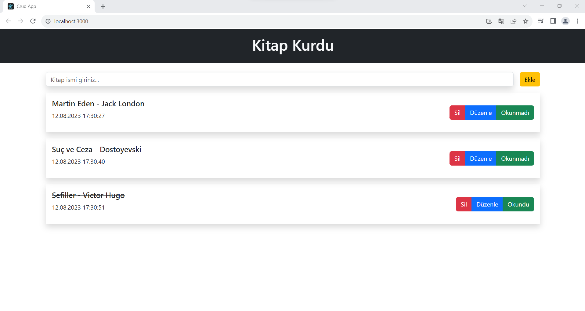
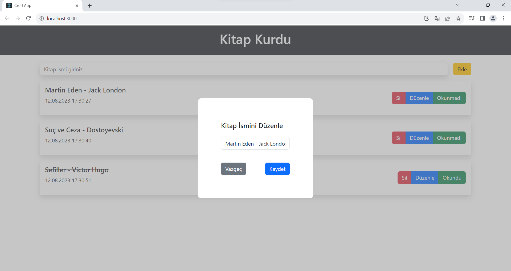
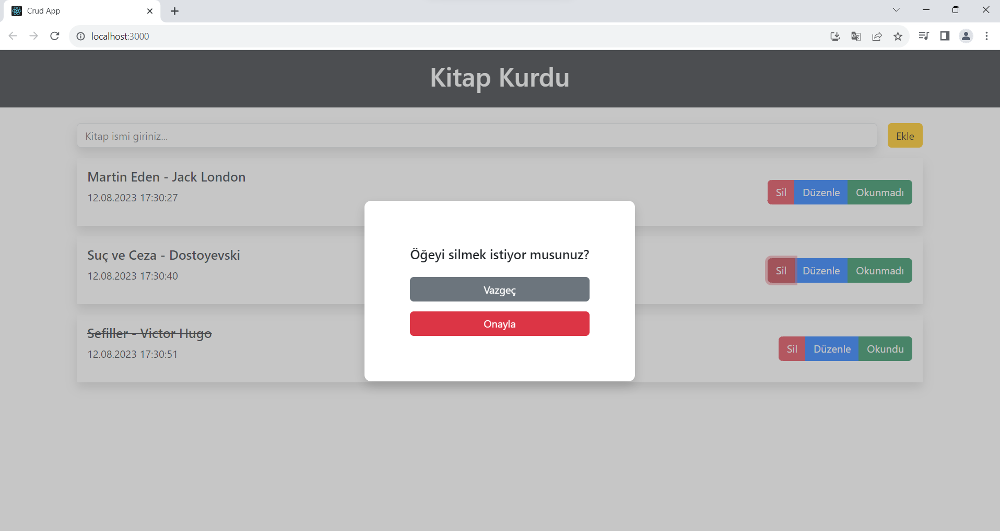

<h1> CRUD APP </h1>

Create - Read - Update - Delete
Oluştur - Oku - Güncelle - Sil

<h2> Kullanılan Teknolojiler</h2>

• Javascript
• React
• HTML 
• CSS
kullanılarak oluşturulmuştur.

<h3> Eklentiler </h3>

- BS dahil edildi
- uuid kütüphanesi eklendi.
- Toastify kütüphanesi eklendi.

<h4>Ekran Görüntüleri</h4>

<h5> GIF </h5>

# YOL HARİTASI #

- Form içinden gelen verileri alıp state'e aktarma
- Ekle butonu ile formdan gelen kitap ismiyle beraber yeni bir obje oluşturma.
- Değerler yer alacak ( Eklenme, güncelleme vb.)
- Kitap, id, okundu bilgisi
- Oluşan obje kitaplar adındaki diziyi tutan state aktarılacak
- İnput temizleme

- books state'inde tutulan kitapları al ve map metodu ile listele
- kitap bilgilerini prop olarak gönder

- kitabın sil butonuna basıldığında elemanı silecek fonksiyonu çalıştır ve id gönder.
- onay penceresi aç ve silmeyi onayla 
handleModal(id) 
- onay modalı aç
- vazgeç butonu ile kapat setShowModal(false)
- onaylanırsa silinecek id'ye eşit olmayanlarla yeni dizi oluştur.
- oluşan diziyi state aktar.

- okundu olarak işaretleme
- okundu butonuna tıklanılınca çalışan fonks.a kitabı gönder
- kitabın isRead değerini tersine çevir
- dizi içerisinde değişecek elemanı bul
- değişecek elemanı çıkar yerine güncel halini ekle
- state güncelle

- Düzenle İşlemini Yap 
- Düzenle butonuna tıklanıldığında kitabı state aktar ve modalı aç
- modalda, kitap ismini değişmek için input olmalı
(value kitabın adı olacak)
- Input her değiştiğinde düzenlenecek elemanın stateini güncelle
- vazgeç butonuna > tıklanılınca modalı kapat
- kaydet butonuna > tıklanılınca handleEditBook fonks. çalıştırılacak
- çalışan fonks. kitaplar dizisini güncellesin
(eski elemanı çıkarıp yenisini koysun
güncellenirken isim ve tarih parametreleri değişecek)

- TOASTIFY bildirimleri eklendi.